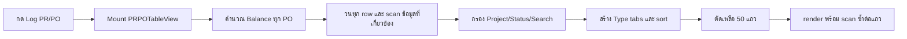
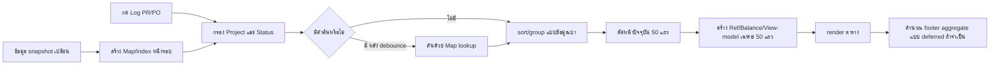

# แผน Hotfix ประสิทธิภาพ Log PR / Log PO

- สถานะ: ดำเนินการ Hotfix แล้ว — automated tests/build ผ่าน; รอ smoke test และวัดผลกับข้อมูล staging/production
- วันที่จัดทำ: 21 สิงหาคม 2026
- ขอบเขต: แก้เฉพาะประสิทธิภาพฝั่ง React/JavaScript โดยยังไม่เปลี่ยน Firestore schema, query หรือข้อมูล production

## 0. ผลการดำเนินการจริง

ดำเนินการในโค้ดแล้วดังนี้:

1. Log PR ไม่สร้าง Payment/Receive index และไม่คำนวณ PO Balance
2. Log PO สร้าง Payment/Receive index เฉพาะผู้มีสิทธิ์ `po-table.viewBalance` และหลังผ่าน Project/Status filter
3. เพิ่ม Map แยกตาม semantics เดิมสำหรับ:
   - Ref PO ที่แสดงใน Log PR
   - PO ที่ใช้คำนวณ PR Balance
   - Ref PR/Cost Code ที่แสดงใน Log PO
   - Payment และ Receive ที่ผูกกับแต่ละ PO
4. สูตรเดิมใน `poPaymentBalance.ts`, `prBudgetReturn.ts` และ `poBudgetReturn.ts` ไม่ถูกแก้ไข
5. ข้อมูล Balance รายแถวคำนวณเฉพาะหน้าปัจจุบัน 50 แถว
6. Balance search ยังค้นได้ตามเดิมเฉพาะ Role ที่เห็น Balance; กรณีนี้จำเป็นต้องคำนวณ candidate rows หลัง debounce เพื่อรักษาพฤติกรรมเดิม
7. Footer ยังคงรวมทั้ง Type ตามเดิม แต่แบ่งคำนวณเป็นช่วงหลัง first paint รวมถึงยอดรวม Ex VAT
8. Search debounce 250 ms, clear ทันที, Enter commit ทันที และรองรับ Thai IME composition
9. Action menu เหลือหนึ่ง instance ต่อแถวตาม viewport และสร้างรายการ Action เมื่อเปิดเมนูเท่านั้น
10. Action ทางการเงินยังคำนวณซ้ำจากข้อมูลเต็มล่าสุดตอนกด ไม่ใช้ค่าที่ cache เพื่อเขียนข้อมูล
11. เมื่อเปิด Log PR หรือ Log PO ระบบเลือกหมวด Type แรกที่มีข้อมูลแทน `All`; `All` ยังเลือกเองได้และเป็น fallback เมื่อไม่มีหมวดอื่น

ผลตรวจอัตโนมัติ:

- `npm.cmd test -- --watchAll=false --runInBand`: ผ่าน 11 suites, 49 tests
- Differential tests ยืนยัน indexed subset ให้ผลสูตร PR/PO Balance เท่ากับ full collection
- `npm.cmd run build`: production build สำเร็จ

ข้อจำกัดที่ยังอยู่:

- Hotfix นี้ลดงานคำนวณ CPU แต่ `AppDataContext` ยัง subscribe PR, PO และ Payment แบบ full collection
- จึงยังไม่ควรสรุปว่า Firestore reads ลดลงทั้งหมด; การลด network reads ต้องทำ Phase 2 ด้วย query ตาม Project/cursor และ summary documents
- ยังต้อง smoke test สิทธิ์จริง, mobile/desktop และเก็บค่า click-to-first-50-rows บนข้อมูล staging/production ก่อน deploy

## 1. สรุปสำหรับผู้ตัดสินใจ

อาการช้าหลักไม่ได้เกิดจากการโหลด PDF ตอนกด `Log PR` หรือ `Log PO` แต่เกิดจากหน้า `PRPOTableView` ประมวลผลข้อมูลทั้งหมดในหน่วยความจำก่อนตัดมาแสดง 50 แถว ได้แก่:

1. คำนวณ PO Balance ทุก PO โดยสแกน Payment และ Receive ทั้งชุด
2. สำหรับ Log PR มีการสแกน PO ทั้งชุดซ้ำเพื่อหา Ref PO และ Balance ของแต่ละ PR
3. กรอง Project/Status หลังจากสร้างข้อมูลประกอบที่มีต้นทุนสูงแล้ว
4. Pagination จำกัดเฉพาะจำนวน DOM ที่แสดง แต่ไม่ได้จำกัดงานคำนวณก่อนหน้า
5. Action menu ถูกสร้างซ้ำทั้งแบบ mobile และ desktop แม้จะแสดงจริงเพียงแบบเดียว
6. ช่องค้นหาประมวลผลใหม่ทุกครั้งที่พิมพ์หนึ่งตัวอักษร

Hotfix นี้จะเปลี่ยนรูปแบบงานจากการสแกนข้อมูลซ้ำลักษณะ `N × M` ให้เป็น:

- สร้างดัชนี `Map` หนึ่งรอบเมื่อชุดข้อมูลเปลี่ยน
- lookup ความสัมพันธ์ด้วย key โดยตรง
- กรองเงื่อนไขราคาถูกก่อน
- คำนวณรายละเอียดหนักเฉพาะหน้าปัจจุบัน 50 แถว
- เลื่อนงานสรุปที่ไม่จำเป็นต่อ first paint ไปทำหลังตารางปรากฏ

กรอบเวลาที่คาด:

- แก้โค้ดหลัก: 1–2 ชั่วโมง
- ทดสอบ regression และ performance: 1–2 ชั่วโมง
- รวม: ประมาณ 2–4 ชั่วโมง โดยไม่ต้องปิดระบบระหว่างพัฒนา

## 2. ขอบเขตของ Hotfix

### 2.1 สิ่งที่จะทำ

- ปรับ `PRPOTableView` ใน `src/AppShell.tsx`
- เพิ่ม pure helper สำหรับสร้างดัชนีความสัมพันธ์ PR/PO/Payment/Receive
- ใช้ helper การคำนวณ Balance เดิม เพื่อรักษากฎธุรกิจ
- เพิ่ม debounce 250 ms ให้ช่องค้นหา
- สร้าง row view-model เฉพาะ 50 แถวที่แสดง
- render Action cell เพียงหนึ่งชุดต่อแถวตาม viewport
- เพิ่ม unit tests, regression tests และ performance measurement

### 2.2 สิ่งที่ยังไม่ทำใน Hotfix นี้

- ยังไม่ทำ Firestore server-side pagination
- ยังไม่สร้าง `prLogSummaries` หรือ `poLogSummaries`
- ยังไม่ย้าย revision history ไป subcollection
- ยังไม่ยกเลิก full-collection listeners ใน `AppDataContext`
- ยังไม่เปลี่ยน business workflow ของ PR, PO, Payment, Receive หรือ Budget Return
- ยังไม่เปลี่ยนหน้าตาหรือสิทธิ์ของปุ่มต่าง ๆ

งานนอกขอบเขตข้างต้นควรทำเป็น Phase 2 หลังวัดผล Hotfix แล้ว

## 3. จุดในโค้ดปัจจุบันที่เกี่ยวข้อง

| จุด | ไฟล์/ตำแหน่งปัจจุบัน | ปัญหา |
|---|---|---|
| Component หลัก | `src/AppShell.tsx:1294` | PR และ PO ใช้ component ขนาดใหญ่ร่วมกัน |
| Page size | `src/AppShell.tsx:1329` | กำหนด 50 แถว แต่ใช้หลังงานคำนวณทั้งหมด |
| PO Balance map | `src/AppShell.tsx:1510` | คำนวณทุก PO แม้อยู่ Log PR หรือไม่มีสิทธิ์ดู Balance |
| PR/PO filter | `src/AppShell.tsx:2528` | สร้าง Ref/Search/Balance ก่อนผ่าน Project และ Status |
| Type grouping | `src/AppShell.tsx:2602` | เดินข้อมูล filtered ทั้งชุด ซึ่งยอมรับได้ถ้าข้อมูลประกอบเป็น O(1) |
| Pagination | `src/AppShell.tsx:2636–2643` | slice 50 แถวหลังคำนวณหนักแล้ว |
| PR Ref PO ตอน render | `src/AppShell.tsx:2861` | สแกน PO ซ้ำต่อแถว |
| Action mobile | `src/AppShell.tsx:2879` | สร้าง Action menu ชุดที่หนึ่ง |
| Action desktop | `src/AppShell.tsx:3020` | สร้าง Action menu ซ้ำชุดที่สอง |
| Search input | `src/AppShell.tsx:2783` | update filter ทุก keystroke ไม่มี debounce |
| Payment matching | `src/lib/poPaymentBalance.ts:40–71` | รองรับ legacy references หลายรูปแบบและสแกน Payment ซ้ำ |
| Receive matching | `src/lib/poPaymentBalance.ts:87–119` | สแกน Receive ซ้ำต่อ PO |
| PR usage/return | `src/lib/prBudgetReturn.ts:8–77` | สแกน PO ซ้ำต่อ PR |

## 4. Data flow ก่อนและหลัง Hotfix

### 4.1 ก่อน Hotfix



### 4.2 หลัง Hotfix



## 5. กฎธุรกิจที่ต้องรักษา

Hotfix ถือว่าสำเร็จต่อเมื่อผลลัพธ์ทางธุรกิจเหมือนเดิมทุกข้อ:

1. ต้องแยก PR↔PO index สำหรับ “การแสดง Ref” ออกจาก index สำหรับ “ยอดทางการเงิน” เพราะกฎเดิมไม่เหมือนกัน
2. Ref PO ที่แสดงใน Log PR ต้องใช้เฉพาะ:
   - `po.prRefId`
   - `po.selectedPrIds[]`
   - `po.items[].prId`
   - ไม่เพิ่ม `disPrAllocations` เข้า Ref PR โดยอัตโนมัติ เพราะพฤติกรรมเดิมไม่ได้ใช้ field นี้ในคอลัมน์ Ref PO
   - รวม PO สถานะ Rejected และรักษาลำดับตาม `pos` เดิม
3. Ref PR ที่แสดงใน Log PO ต้องใช้ union ของ:
   - `po.prRefId`
   - `po.selectedPrIds[]`
   - `po.items[].prId`
   - `po.items[].disPrAllocations[].prId`
   - deduplicate PR No./Cost Code ด้วย `Set` เหมือนเดิม
4. Financial link ต้องใช้ `isPoLinkedToPr` เดิม ซึ่งให้ `disPrAllocations` มี precedence เหนือ `item.prId` เมื่อ allocation array ไม่ว่าง และต้องตัด PO Rejected
5. Ref PR ของ PO ต้องแสดงทั้ง PR No. และ Cost Code เดิม รวมถึง fallback `item.prNo` เมื่อ PR document ถูกลบหรือหาไม่พบ
6. Payment ต้องยังจับคู่ PO ได้จาก:
   - `selectedPrIds[]` ที่ legacy ใช้เก็บ PO ID
   - `sourcePoId`, `poId`, `poRef`
   - `sourcePoNo`, `poNo`, `poRef`
   - `items[].poId`, `items[].prId`
   - prefix ของ `paymentNo`
7. Receive matching ต้องคง predicate เดิม: `poId` หรือ `(poNo || poRef)` เทียบกับ PO number variants
   - ถ้ามี `poNo` แต่ค่าไม่ตรง ห้าม fallback ไป `poRef` โดยอัตโนมัติ
   - Receive หนึ่งใบอาจ match มากกว่าหนึ่ง PO จาก legacy conflicting fields จึงห้ามบังคับ one-to-one
8. PO Revision ต้องรองรับ `poNo`, `originalPoNo` และเลขฐานก่อน `_R.n`
9. Payment สถานะ `Reject`/`Rejected` ต้องไม่ถูกนำมาคำนวณยอด ส่วน Draft/Pending ให้คงพฤติกรรมเดิม
10. PO สถานะ `Rejected` ต้องไม่ถูกนำมาคำนวณ PR usage/return balance แต่ Ref PO ที่แสดงต้องคงพฤติกรรมเดิม
11. Receive ไม่กรอง status ใน logic เดิม จึงห้ามเพิ่ม status filter ใน Hotfix
12. กฎส่วนลด, `discountAllocationVersion`, latest payment ordering และ accumulated amount ต้องใช้ helper เดิม
13. SP/DC ต้องยังเลือก Payment route ตามกฎเดิม ส่วน PO ประเภทอื่นใช้ Receive route เมื่อไม่มี Payment; PO ประเภท ML ที่มี Payment ต้องใช้ Payment
14. ลำดับรายการ pending ต้องขึ้นก่อนรายการปกติโดยรักษาลำดับเดิมของรายการที่มี priority เท่ากัน
15. จำนวนใน Type tabs, filter และ pagination ต้องตรงกับข้อมูลเดิม ห้าม paginate ก่อนสร้าง Type groups/counts
16. ผู้ไม่มีสิทธิ์ `viewBalance` ต้องไม่เห็นและไม่สามารถค้นหาค่าของ Balance ที่ถูกซ่อน
17. ผู้มีสิทธิ์ `returnBudget` ต้องยังใช้ข้อมูล Balance ที่ action นั้นต้องการ แม้คอลัมน์ Balance ถูกซ่อน
18. Action ทางการเงินต้องตรวจข้อมูลล่าสุดตอนกด ห้ามใช้ cached page view-model เป็นแหล่งข้อมูลสุดท้ายสำหรับการเขียน
19. ปุ่ม Email, Download, Close, Active, Delete, Recreate และ Return Budget ต้องทำงานเหมือนเดิม

## 6. โครงสร้าง Map/Index ที่จะเพิ่ม

แนะนำเพิ่มไฟล์ `src/lib/prPoLogIndexes.ts` เพื่อให้ logic เป็น pure functions และทดสอบแยกจาก React ได้

| Index | รูปแบบ | สร้างจาก | ใช้สำหรับ |
|---|---|---|---|
| `poById` | `Map<poId, PO>` | `pos` | lookup PO โดยตรง |
| `poIdsByNumberAlias` | `Map<poNoVariant, Set<poId>>` | `pos` | รองรับเลข PO ปัจจุบัน/original/revision |
| `financialPosByPrId` | `Map<prId, PO[]>` | `pos + isPoLinkedToPr` | PR Balance/Budget Return ตาม allocation precedence และไม่รวม Rejected |
| `displayPoRefsByPrId` | `Map<prId, Array<{poId, poNo}>>` | `pos` | แสดง/ค้น Ref PO ใน Log PR ตามกฎ display เดิมและรักษาลำดับ/เลขซ้ำ |
| `poMetaById` | `Map<poId, { prNos, costCodes }>` | `pos + prById` | แสดง/ค้น Ref PR และ Cost Code ใน Log PO |
| `paymentsByPoId` | `Map<poId, Payment[]>` | `payments + PO aliases` | คำนวณ PO Balance ด้วยรายการที่เกี่ยวข้องเท่านั้น |
| `receivesByPoId` | `Map<poId, Receive[]>` | `receives + PO aliases` | คำนวณ PO Balance ด้วยรายการที่เกี่ยวข้องเท่านั้น |
| `budgetById` | `Map<budgetId, Budget>` | `budgets` | ชื่อ Budget โดยไม่ใช้ `.find()` ซ้ำ |
| `budgetByProjectCode` | `Map<projectId::costCode, Budget>` | `budgets` | fallback lookup Budget |
| `projectById` | มีอยู่แล้ว | `projects` | ชื่อโครงการ |
| `vendorById` | มีอยู่แล้ว | `vendors` | ชื่อ Vendor |

คำว่า “สร้างหนึ่งรอบ” หมายถึงหนึ่งรอบต่อ snapshot ของ input ที่เปลี่ยน ไม่ใช่สร้างใหม่ต่อ row หรือต่อ keystroke

## 7. ขั้นตอนพัฒนาอย่างละเอียด

### ขั้นตอนที่ 0 — เก็บ Baseline ก่อนแก้

เป้าหมาย: มีตัวเลขยืนยันว่าจุดใดช้าและใช้เปรียบเทียบหลังแก้

1. เพิ่ม `performance.mark()` เฉพาะ development รอบ:
   - เริ่มคลิก Log
   - เริ่ม/จบสร้าง indexes
   - เริ่ม/จบ filter
   - เริ่ม/จบ page view-model
   - commit หลัง 50 แถวปรากฏ
2. บันทึกจำนวน:
   - `prs.length`
   - `pos.length`
   - `payments.length`
   - `receives.length`
   - candidate rows หลัง Project/Status
3. ห้าม log เนื้อหาเอกสาร, ชื่อบุคคล, เลขบัญชี หรือ payload จริง
4. ทดสอบอย่างน้อยสองรอบ:
   - เปิด Log ครั้งแรกหลัง refresh
   - สลับ System → Log ซ้ำครั้งที่สอง
5. เก็บค่า:
   - click-to-first-table
   - เวลา build balance map เดิม
   - เวลา filter เดิม
   - long task ที่มากกว่า 50 ms

ผลลัพธ์ของขั้นตอนนี้: baseline ก่อนแก้หนึ่งชุดสำหรับ Log PR และหนึ่งชุดสำหรับ Log PO

### ขั้นตอนที่ 1 — สร้าง PR ↔ PO indexes

เป้าหมาย: เดิน `pos` หนึ่งรอบและเก็บความสัมพันธ์ทั้งหมด

1. สร้าง `buildPrPoIndexes(pos, prById)` ใน `src/lib/prPoLogIndexes.ts`
2. สำหรับ PO แต่ละใบ:
   - เก็บ `prRefId`
   - เก็บทุกค่าใน `selectedPrIds`
   - เดิน `items` หนึ่งรอบ
   - เก็บ `item.prId`
   - เก็บทุก `allocation.prId` ใน `disPrAllocations`
3. สร้าง `displayPoRefsByPrId` ด้วยกฎ display เดิมเท่านั้น และรักษาลำดับ PO ตาม input
4. สร้าง `financialPosByPrId` แยกต่างหากด้วย `isPoLinkedToPr` และไม่รวม PO Rejected
5. เมื่อ item มี `disPrAllocations` ที่ไม่ว่าง ต้องรักษา precedence เดิมและห้ามนำ `item.prId` ไปคิด financial link เพิ่ม
6. สร้าง `poMetaById` ด้วย union ของ direct/allocation/selected/ref IDs สำหรับ Log PO
7. ใช้ `Set` กัน PR No. และ Cost Code ซ้ำเฉพาะ `poMetaById`; อย่า deduplicate ข้อความ Ref PO ของ Log PR ถ้าพฤติกรรมเดิมยังแสดงเลข PO ซ้ำจากคนละ document
8. อย่าใส่ business formula ใหม่ใน index builder
9. กรณี PR ID หาไม่พบ ให้เก็บ fallback จาก `item.prNo` และ `po.costCode` ตามพฤติกรรมเดิม

ตัวอย่างรูปแบบผลลัพธ์:

```ts
type PrPoIndexes = {
  financialPosByPrId: Map<string, any[]>;
  displayPoRefsByPrId: Map<string, Array<{ poId: string; poNo: string }>>;
  poMetaById: Map<string, { prNos: string[]; costCodes: string[] }>;
};
```

ใน React ให้สร้างด้วย `useMemo`:

```ts
const prPoIndexes = React.useMemo(
  () => buildPrPoIndexes(pos, prById),
  [pos, prById]
);
```

ผลที่ต้องได้: ห้ามมี `pos.filter(...)` ภายใน filter callback หรือ render callback ของแต่ละ PR

### ขั้นตอนที่ 2 — สร้าง Payment/Receive indexes โดยรักษา legacy matching

เป้าหมาย: ลดจากทุก PO สแกน Payment/Receive ทั้งชุด เป็น PO lookup เฉพาะรายการที่เกี่ยวข้อง

1. สร้าง `poById` และ `poIdsByNumberAlias` ก่อน
2. ใช้ `getPoNumberVariants(po)` เดิมเพื่อสร้าง alias ของ PO:
   - current PO No.
   - original PO No.
   - base PO No. ก่อน revision suffix
3. สำหรับ Payment แต่ละรายการ ให้รวบรวม candidate keys จากทุก field ที่ helper เดิมรองรับ
4. สำหรับ `paymentNo` ให้ลองตัด suffix งวดท้าย เช่น `-001` แล้ว lookup ใน PO alias map
5. ถ้า Payment หนึ่งรายการชี้ได้หลาย PO ให้เก็บทุก candidate และใช้ `isPaymentLinkedToPo` เดิมยืนยันก่อนเพิ่มเข้า map
6. สำหรับ Receive ให้สร้าง candidate จาก `poId` และค่า `(poNo || poRef)` ตาม precedence เดิม แล้วใช้ `isReceiveLinkedToPo` ยืนยัน
   - อย่า index `poNo` และ `poRef` พร้อมกันโดยไม่ผ่าน predicate เพราะจะเปลี่ยนผลของ legacy record
   - ถ้า field คนละชุดชี้คนละ PO ให้ยอมให้หนึ่ง Receive อยู่ใน map ของหลาย PO เมื่อ predicate เดิม match
7. ถ้าข้อมูล legacy resolve ไม่ได้:
   - ห้ามทิ้งเงียบ
   - เก็บ count `unresolvedPaymentCount`/`unresolvedReceiveCount` เฉพาะ development
   - ใช้ helper เดิมเป็น fallback เฉพาะ candidate/page rows ระหว่างช่วง Hotfix
8. ห้ามเปลี่ยน formula ใน `getPoPaymentAndReceiveBalanceInfo`
9. เรียก helper เดิมโดยส่ง array ที่ถูก group แล้ว:

```ts
getPoPaymentAndReceiveBalanceInfo(
  po,
  paymentsByPoId.get(String(po.id)) || [],
  receivesByPoId.get(String(po.id)) || []
);
```

10. สร้าง indexes ด้วย `useMemo` เฉพาะเมื่อจำเป็น:

```ts
const needsPoBalanceWork =
  !isPR && (canViewPoBalance || canStartPoBudgetReturn);

const poDocumentIndexes = React.useMemo(
  () => needsPoBalanceWork
    ? buildPoDocumentIndexes(pos, payments, receives)
    : EMPTY_PO_DOCUMENT_INDEXES,
  [needsPoBalanceWork, pos, payments, receives]
);
```

หมายเหตุ: `returnBudget` เป็น permission ที่จำเป็นต้องใช้ Balance ภายใน action แม้ผู้ใช้ไม่ได้เปิดคอลัมน์ Balance จึงต้องรวมในเงื่อนไข

### ขั้นตอนที่ 3 — หยุดงาน PO-only ใน Log PR

เป้าหมาย: เปิด Log PR แล้วไม่สร้าง PO Payment/Receive Balance map

1. ลบการสร้าง `poPaymentBalanceById` แบบ unconditional ปัจจุบัน
2. แยกเงื่อนไข:
   - Log PR: ไม่สร้าง Payment/Receive indexes
   - Log PO ไม่มีสิทธิ์ Balance/Return Budget: ไม่สร้าง indexes
   - Log PO มีสิทธิ์: สร้าง indexes ตามขั้นตอนที่ 2
3. เอา `poPaymentBalanceById` ออกจาก dependency ของ PR filter
4. PR Balance ให้ใช้ `linkedPosByPrId`:

```ts
const getPrReturnInfo = (pr: any) => getPrBudgetReturnInfo(
  pr,
  prPoIndexes.financialPosByPrId.get(String(pr.id)) || []
);
```

5. คำนวณ PR return info เฉพาะเมื่อ:
   - แสดงคอลัมน์ Balance หรือ
   - ต้องแสดง Return Balance action

ผลที่ต้องได้: snapshot ของ `payments` หรือ `receives` ไม่ควรทำให้ Log PR filter ใหม่

### ขั้นตอนที่ 4 — กรอง Project และ Status ก่อน enrichment

เป้าหมาย: ตัดจำนวน candidate rows ด้วยเงื่อนไขราคาถูกก่อนงานอื่น

ลำดับใหม่ต้องเป็น:

1. เลือก source rows จาก `prs` หรือ `pos`
2. กรอง `projectId`
3. กรอง status ด้วย `getRowStatus`
4. ใช้ debounced search เมื่อมีคำค้น
5. sort pending-first
6. สร้าง Type groups
7. เลือก active Type
8. slice หน้าปัจจุบัน 50 แถว
9. สร้าง row view-model เฉพาะ page rows

ตัวอย่าง:

```ts
const scopedRows = React.useMemo(() => {
  return rows.filter((row) => {
    if (filterProject !== "all" && row.projectId !== filterProject) return false;
    const status = getRowStatus(row);
    if (
      filterStatus !== "all" &&
      status !== filterStatus &&
      (isPR || (row.status !== filterStatus && row.statusNow !== filterStatus))
    ) return false;
    return true;
  });
}, [rows, filterProject, filterStatus, getRowStatus, isPR]);
```

ข้อห้าม:

- ห้ามสร้าง PO Ref text ก่อน row ผ่าน Project/Status
- ห้ามคำนวณ Balance ก่อน row ผ่าน Project/Status
- ห้าม format วันที่/จำนวนเงิน/description ก่อนทราบว่า row อยู่หน้าปัจจุบัน เว้นแต่ field นั้นจำเป็นต่อ search

### ขั้นตอนที่ 5 — เพิ่ม debounce ให้ Search

เป้าหมาย: ไม่ filter ข้อมูลใหม่ทุก keystroke

1. เก็บ `searchInput` สำหรับค่าที่ผู้ใช้กำลังพิมพ์
2. สร้าง `debouncedSearchTerm` หน่วง 250 ms
3. clear timer ทุกครั้งที่ input เปลี่ยนหรือ component unmount
4. normalize เพียงครั้งเดียว:
   - `trim()`
   - `toLowerCase()`
5. reset page เป็น 1 ทันทีเมื่อ raw search เปลี่ยนเพื่อรักษาพฤติกรรมเดิม แต่ให้ heavy filter รอค่า debounced
6. ถ้าผู้ใช้กดล้างคำค้น ให้ commit ค่าว่างทันทีโดยไม่รอ 250 ms
7. รองรับ Thai IME ด้วย `compositionstart`/`compositionend` และห้ามค้นหาระหว่างกำลัง compose
8. ระหว่างรอ debounce สามารถแสดง indicator เล็ก ๆ ว่า “กำลังค้นหา” แต่ห้ามบล็อก input
9. กด Enter สามารถ commit search ทันทีและยกเลิก timer ได้
10. snapshot ใหม่ระหว่างรอ debounce ต้องใช้ข้อมูลล่าสุดกับ effective term ห้ามปิดทับ array เก่าไว้ใน timer closure
11. อย่าใช้ `useDeferredValue` แทน debounce เพียงอย่างเดียว เพราะยังอาจประมวลผลค่าระหว่างทางทุกค่า

แนะนำเพิ่ม hook:

```ts
// src/hooks/useDebouncedValue.ts
export function useDebouncedValue<T>(value: T, delayMs: number): T;
```

เงื่อนไขการค้นหา:

- ถ้าคำค้นว่าง ให้คืน `scopedRows` โดยตรง ห้ามสร้าง search blob
- Log PR ใช้ `poRefsByPrId` สำหรับ Ref PO
- Log PO ใช้ `poMetaById`, `projectById`, `vendorById`
- ค้น Balance เฉพาะเมื่อผู้ใช้มีสิทธิ์ `viewBalance`
- เมื่อจำเป็นต้องค้น Balance ให้คำนวณเฉพาะ `scopedRows` หลัง debounce โดยใช้ grouped maps ไม่สแกน collection เดิมซ้ำ

### ขั้นตอนที่ 6 — แบ่งหน้าก่อนสร้างข้อมูลหนัก

เป้าหมาย: first paint ใช้งานข้อมูลหนักไม่เกิน 50 แถว

1. หลัง filter/sort/type group ให้คำนวณ `pageRows` เหมือนเดิม
2. สร้าง `pageRowModels` ด้วย `useMemo`
3. ใน view-model ของ Log PR ค่อยคำนวณ:
   - Ref PO text
   - Budget description
   - PR return/balance info เมื่อมีสิทธิ์
   - formatted date/amount
   - pending/action metadata
4. ใน view-model ของ Log PO ค่อยคำนวณ:
   - linked PR Nos./Cost Codes
   - Vendor/Project labels
   - Payment/Receive Balance เมื่อจำเป็น
   - formatted date/amount
   - pending/action metadata
5. JSX row ต้องอ่านค่าจาก view-model เป็นหลัก ไม่เรียก `.filter()`, `.find()` หรือ business helper ซ้ำ
6. Event handler ของ action ที่มีผลต่อยอดต้องดึง row/state ล่าสุดและให้ transaction/helper เดิมตรวจซ้ำตอนกด ห้ามเชื่อค่าที่ cache เพื่อแสดงผลเพียงอย่างเดียว

ตัวอย่าง:

```ts
const pageRowModels = React.useMemo(
  () => pageRows.map((row) => buildLogRowModel({
    row,
    mode,
    indexes,
    permissions,
  })),
  [pageRows, mode, indexes, permissions]
);
```

7. สร้าง `pagePoBalanceById` เฉพาะ page rows:

```ts
const pagePoBalanceById = React.useMemo(() => {
  if (!needsPoBalanceWork) return EMPTY_MAP;
  const result = new Map();
  pageRows.forEach((po) => {
    result.set(po.id, calculatePoBalanceFromIndexes(po, poDocumentIndexes));
  });
  return result;
}, [needsPoBalanceWork, pageRows, poDocumentIndexes]);
```

### ขั้นตอนที่ 7 — จัดการยอดรวม Footer โดยไม่บล็อก first paint

ปัจจุบัน footer รวมยอดของ `activeRows` ทั้งหมด ไม่ใช่เฉพาะหน้าปัจจุบัน จึงต้องรักษาความหมายเดิม

แนวทางที่แนะนำ:

1. render 50 แถวก่อน
2. แสดง footer Balance เป็น `กำลังคำนวณ…` ชั่วคราว
3. หลัง first paint คำนวณ aggregate ของ `activeRows` จาก grouped maps
4. ใช้ `requestIdleCallback` พร้อม fallback `setTimeout(..., 0)`
5. ยกเลิกงานเก่าเมื่อ filter/type/page dependency เปลี่ยน
6. ตรวจ request/version ID ก่อน commit เพื่อกันผลลัพธ์เก่าทับ filter ใหม่
7. เมื่อคำนวณเสร็จ แสดงยอดรวมแบบเดิม

เนื่องจาก grouped maps ทำให้ lookup เป็นรายการที่เกี่ยวข้องเท่านั้น งาน aggregate จะเป็นเชิงเส้นและไม่กลับไปเป็น `PO × Payment/Receive`

### ขั้นตอนที่ 8 — ตัด Action render ซ้ำ

เป้าหมาย: หนึ่ง row สร้าง Action menu เพียงหนึ่งครั้ง

ปัจจุบันเรียก `renderActionCell` สองครั้งและซ่อนด้วย CSS:

- mobile cell อยู่ต้นแถว
- desktop cell อยู่ท้ายแถว

แนวทางแบ่งเป็นสองชั้นเพื่อให้ทั้งเร็วและเสี่ยงต่ำ:

1. เปลี่ยน `TableActionMenu` ให้รับ render function และสร้าง regular action items เมื่อ menu ถูกเปิดเท่านั้น
   - ขั้นนี้หยุด `getPrBudgetReturnInfo`/`buildPoBudgetReturnPlan` ที่ถูกเรียก eager สองครั้งต่อ row
   - ห้าม cache action model ข้าม snapshot; ให้คำนวณใหม่เมื่อผู้ใช้เปิด menu
2. เพิ่ม `useMediaQuery("(min-width: 768px)")` หรือส่งค่า viewport ที่มีอยู่ลงมา
3. ถ้า mobile ให้ render Action cell ที่ต้นแถวเท่านั้น
4. ถ้า desktop ให้ render Action cell ที่ท้ายแถวเท่านั้น
5. สร้าง metadata ราคาถูกใน `pageRowModels` หนึ่งครั้ง:
   - `isActionTask`
   - `pendingActionLabel`
   - `isActivePoTask`
   - permission flags
6. คำนวณ PR return info หรือ PO return plan เฉพาะเมื่อคอลัมน์ต้องใช้หรือเมื่อ menu เปิด
7. ห้ามเรียก `getPrBudgetReturnInfo` หรือ `buildPoBudgetReturnPlan` ซ้ำภายในหลาย Action cells
8. รักษาข้อยกเว้นเดิม:
   - pending task ซ่อน regular actions
   - PO Budget Return และ Delete อาจยังแสดงแม้ row เป็น action task
   - permission keys ที่ใช้ทั้ง `pr-table`/`po-table` และ `pr`/`po` ต้องไม่ถูกรวมผิด
9. handler ของ menu ต้องยัง `stopPropagation()` เพื่อไม่เปิด PO Detail โดยไม่ตั้งใจ
10. ตรวจการเปลี่ยน viewport ว่า header และ cell count ยังตรงกัน
11. ระบบนี้ไม่มี SSR จึงใช้ `window.matchMedia` ได้ แต่ต้อง unsubscribe listener ตอน unmount
12. ใช้ in-flight ref ป้องกัน double-click action สำคัญก่อน state rerender และทดสอบว่าเกิด write/log ครั้งเดียว

### ขั้นตอนที่ 9 — ลด `.find()` และการ format ซ้ำใน 50 แถว

1. เพิ่ม `budgetById`
2. เพิ่ม `budgetByProjectCode` โดยใช้ key `${projectId}::${costCode}`
3. ใช้ `vendorById` ที่มีอยู่แทน `vendors.find()` ใน render
4. ใช้ `projectById` ที่มีอยู่
5. คำนวณ Budget main/sub description ใน page view-model
6. format วันที่และจำนวนเงินครั้งเดียวต่อ row model
7. memoize callbacks ที่ถูกส่งเข้า row/action เมื่อจำเป็น

ขั้นตอนนี้เป็น optimization รอง แต่ช่วยลดงานซ้ำและทำให้ JSX ตรวจสอบง่ายขึ้น

### ขั้นตอนที่ 10 — ตรวจ dependency และ snapshot re-render

1. ตรวจ dependency ของทุก `useMemo` หลังแยก PR/PO work
2. PR filter ต้องไม่ depend on:
   - `payments`
   - `receives`
   - `poPaymentBalanceById`
3. PO filter ที่ไม่ค้น Balance ไม่ควร depend on page balance map
4. page view-model เปลี่ยนเมื่อ page rows หรือ index ที่เกี่ยวข้องเปลี่ยนเท่านั้น
5. footer aggregate แยก state/dependency จาก page view-model
6. หลีกเลี่ยงสร้าง empty object/map ใหม่ทุก render โดยใช้ constant เช่น `EMPTY_MAP`
7. ใช้ React Profiler ยืนยันว่า Payment snapshot ที่มาทีหลังไม่ทำให้ Log PR ทำ filter งานหนักซ้ำ

## 8. ลำดับไฟล์ที่คาดว่าจะเปลี่ยน

| ลำดับ | ไฟล์ | การเปลี่ยนแปลง |
|---|---|---|
| 1 | `src/lib/prPoLogIndexes.ts` | pure index builders และ lookup helpers |
| 2 | `src/lib/prPoLogIndexes.test.js` | unit tests ของ PR/PO/Payment/Receive mapping |
| 3 | `src/hooks/useDebouncedValue.ts` | debounce hook 250 ms |
| 4 | `src/AppShell.tsx` | integrate indexes, filter order, page models, single action cell |
| 5 | `src/lib/poPaymentBalance.test.js` | เพิ่ม regression cases สำหรับ legacy/revision matching ถ้าขาด |
| 6 | `src/lib/prBudgetReturn.test.js` | เพิ่ม regression cases สำหรับ linked subset ถ้าขาด |

ไม่ควรแก้ formula ใน `poPaymentBalance.ts` หรือ `prBudgetReturn.ts` ระหว่าง Hotfix เว้นแต่ test พบ defect เดิมที่ต้องแยกเป็นงานต่างหาก

## 9. แผนทดสอบ

### 9.0 Differential/Golden tests — ต้องทำก่อนเปลี่ยน component

สร้าง fixture ที่มีทั้งข้อมูล modern และ legacy แล้วรัน logic เก่ากับ index/selector ใหม่เพื่อเปรียบเทียบผลโดยตรง:

- [ ] คู่ PR×PO ที่ match ต้องเหมือนเดิมสำหรับ display link
- [ ] คู่ PR×PO ที่ match ต้องเหมือนเดิมสำหรับ financial link
- [ ] คู่ Payment×PO ที่ match ต้องเหมือน `isPaymentLinkedToPo`
- [ ] คู่ Receive×PO ที่ match ต้องเหมือน `isReceiveLinkedToPo`
- [ ] ordered filtered row IDs ต้องเหมือนเดิม
- [ ] Type tab keys/counts และ All count ต้องเหมือนเดิม
- [ ] page row IDs ทุกหน้าต้องเหมือนเดิม
- [ ] Ref strings ต้องเหมือนเดิมรวมทั้งลำดับและเลขซ้ำ
- [ ] PR/PO Balance output ต้องเท่ากันถึงทศนิยมสองตำแหน่ง

Differential test เป็นเกราะหลักของ Hotfix เพราะช่วยจับกรณี legacy ที่ schema ไม่สม่ำเสมอโดยไม่ต้องเขียนความคาดหวังใหม่ทุกกรณี

### 9.1 Unit tests: PR ↔ PO

- [ ] `prRefId` สร้าง Ref ได้ถูกต้อง
- [ ] `selectedPrIds` หลายรายการไม่ซ้ำ
- [ ] `items[].prId` ถูก index
- [ ] `disPrAllocations[].prId` ถูก index
- [ ] display index ไม่เพิ่ม allocation-only link เข้า Log PR โดยไม่ตั้งใจ
- [ ] financial index ใช้ allocation แทน direct `item.prId` เมื่อ allocation array ไม่ว่าง
- [ ] PO ที่ผูกหลาย PR คืน Ref ครบทุก PR
- [ ] ลำดับ Ref และ PO No. ซ้ำจากคนละ document เหมือนเดิม
- [ ] PO ที่ Rejected ยังแสดง Ref ตามพฤติกรรม display เดิม
- [ ] PO ที่ Rejected ไม่ถูกคิด PR usage
- [ ] missing PR document ใช้ fallback ได้โดยไม่ throw

### 9.2 Unit tests: Payment ↔ PO

- [ ] match ด้วย `sourcePoId`
- [ ] match ด้วย `poId`
- [ ] match ด้วย `poRef`
- [ ] match ด้วย `sourcePoNo`
- [ ] match ด้วย `poNo`
- [ ] match ด้วย legacy `selectedPrIds`
- [ ] match ด้วย `items[].poId`
- [ ] match ด้วย legacy `items[].prId`
- [ ] match ด้วย `paymentNo` prefix
- [ ] match PO revision current/original/base number
- [ ] link ซ้ำหลาย field ถูกนับ Payment document เดียวเพียงครั้งเดียวต่อ PO
- [ ] Payment หนึ่งรายการที่ predicate เดิม match หลาย PO ถูก index ให้ทุก PO
- [ ] PO No. ที่เป็น prefix ซ้อนกันยังได้ผลเหมือน predicate เดิม
- [ ] Payment Rejected ไม่ถูกคิดยอด
- [ ] Payment Draft/Pending คงพฤติกรรมเดิม
- [ ] latest period ordering เหมือน helper เดิม
- [ ] period, timestamp และ id tie-break เหมือน helper เดิม
- [ ] Payment ที่ resolve ไม่ได้เข้า fallback โดยไม่ทำให้ยอดผิด

### 9.3 Unit tests: Receive ↔ PO

- [ ] match ด้วย `poId`
- [ ] match ด้วย `poNo`
- [ ] match ด้วย `poRef`
- [ ] มี `poNo` ผิดแต่ `poRef` ถูกแล้วผลยังเหมือน `(poNo || poRef)` เดิม
- [ ] `poId` และ PO number ชี้คนละ PO แล้ว index ให้ทุก PO ที่ predicate เดิม match
- [ ] match PO revision aliases
- [ ] Receive หลายใบรวมยอดครบ
- [ ] Receive ไม่ถูกกรองออกตาม status ใหม่โดยไม่ตั้งใจ
- [ ] explicit amount 0/negative และ fallback qty×price เหมือนเดิม
- [ ] ส่วนลด PO ถูกเฉลี่ยกับ Receive เหมือนเดิม
- [ ] used amount ถูก cap ที่ PO net เหมือนเดิม
- [ ] ML ที่มี Payment เลือก Payment route

### 9.4 Selector/filter tests

- [ ] default selected project แสดงเฉพาะ project เดิม
- [ ] `all` projects แสดงครบ
- [ ] status filter ของ PR ถูกต้อง
- [ ] status/statusNow filter ของ PO ถูกต้อง
- [ ] pending rows อยู่บนสุด
- [ ] Type tabs และ counts เท่าเดิม
- [ ] page 1/2 และแถวที่ 50/51 ถูกต้อง
- [ ] filter เปลี่ยนแล้วกลับ page 1
- [ ] search PR No./PO No./Cost Code/Vendor/Project/Ref ถูกต้อง
- [ ] search date/item count/amount/status/statusNow มี parity กับของเดิม
- [ ] ค่าเลข 0 ใน search blob มีพฤติกรรมเหมือน `.filter(Boolean)` เดิม
- [ ] search ว่างไม่เรียก balance helper
- [ ] search Balance ทำงานเฉพาะผู้มีสิทธิ์
- [ ] ผู้ไม่มีสิทธิ์ค้น hidden Balance ไม่พบข้อมูลจากค่าที่ซ่อน

### 9.5 Debounce tests

- [ ] พิมพ์ต่อเนื่องไม่ filter ก่อน 250 ms
- [ ] หยุดพิมพ์แล้ว filter หนึ่งครั้ง
- [ ] กด Enter แล้วค้นทันที
- [ ] unmount แล้ว timer ถูก clear
- [ ] clear input commit ทันที
- [ ] Thai IME ไม่ค้นหาระหว่าง composition และค้นหลัง compositionend
- [ ] query เก่าไม่ทับ query ใหม่
- [ ] snapshot ใหม่ระหว่างรอ debounce ใช้ข้อมูลล่าสุด

### 9.6 Action/UI tests

- [ ] mobile มี Action menu หนึ่งชุดต่อ row
- [ ] desktop มี Action menuหนึ่งชุดต่อ row
- [ ] resize mobile ↔ desktop แล้ว column alignment ถูกต้อง
- [ ] Pending approve action ทำงาน
- [ ] Email PDF ทำงาน
- [ ] Download PDF ทำงาน
- [ ] Close PR/PO ทำงาน
- [ ] Active PR/PO ทำงาน
- [ ] Return PR Balance ทำงาน
- [ ] Return PO Budget ทำงาน
- [ ] Delete/Recreate PO ทำงานตามสิทธิ์
- [ ] เปิด PO Detail และ PDF ไม่เปลี่ยนพฤติกรรม
- [ ] PO Budget Return/Delete exceptions ยังปรากฏใน action-task row ตามกฎเดิม
- [ ] click menu ไม่ trigger row detail
- [ ] double-click action สำคัญเกิด write/log ครั้งเดียว

### 9.7 Regression tests ตามสิทธิ์

ทดสอบอย่างน้อย:

- Administrator
- PCM/Procurement ที่มี pending actions
- ผู้มี `viewBalance`
- ผู้มี `returnBudget` แต่ไม่มี `viewBalance`
- ผู้ไม่มีสิทธิ์ Balance และ Return Budget

### 9.8 Performance tests

ใช้ fixture จำลองอย่างน้อย:

- 1,000 PR
- 1,000 PO
- 5,000 Payment
- 5,000 Receive
- 50–100 Budget/Project records

วัด:

- เวลา build indexes
- เวลาเปิด Log PR
- เวลาเปิด Log PO
- เวลา filter project/status
- เวลา search หลัง debounce
- จำนวนครั้งที่ balance helper ถูกเรียก
- จำนวนครั้งที่ action plan/helper ถูกเรียกก่อนและหลังเปิด menu
- จำนวน React commits เมื่อ Payment/Receive snapshot เปลี่ยน

## 10. คำสั่งตรวจสอบก่อนส่งงาน

```powershell
npm test -- --watchAll=false --runInBand
npm run build
```

หลัง build ให้ smoke test production build อย่างน้อย:

1. Login
2. เลือกโครงการที่มี PR/PO จำนวนมาก
3. เปิด Log PR
4. เปลี่ยน Type/Status/Search/Page
5. เปิด Log PO
6. ตรวจ Payment & Receive และ Balance PO
7. เปิด PO Detail
8. สลับ System ↔ Log ซ้ำ
9. ทดสอบ viewport mobile และ desktop

## 11. เกณฑ์รับงาน

### 11.1 Performance

- [ ] Warm click-to-first-50-rows ไม่เกิน 500 ms ที่ dataset production ปัจจุบัน
- [ ] Cold click-to-first-50-rows เป้าหมายไม่เกิน 1,000 ms
- [ ] ไม่มี synchronous long task เกิน 100 ms ระหว่างเปิดแท็บ หรือมีน้อยลงอย่างชัดเจนจาก baseline
- [ ] Log PR ไม่สร้าง Payment/Receive balance indexes
- [ ] Initial render คำนวณ Balance ไม่เกินจำนวน page rows ยกเว้น debounced balance search
- [ ] การพิมพ์ search ไม่ทำให้ UI ค้าง
- [ ] Action menu ถูกสร้างหนึ่งครั้งต่อ row

### 11.2 Correctness

- [ ] จำนวนรายการ/filter/type tab เท่าเดิม
- [ ] Ref PR/PO เท่าเดิม
- [ ] Payment, Receive, PR Balance และ PO Balance เท่าเดิมทุก test fixture
- [ ] pending order และ permissions เท่าเดิม
- [ ] action ทุกตัวทำงานเหมือนเดิม
- [ ] ไม่มี hidden Balance data leak ผ่าน search

### 11.3 Build quality

- [ ] test ผ่านทั้งหมด
- [ ] production build ผ่าน
- [ ] ไม่มี console error ใหม่
- [ ] ไม่มี unresolved legacy mapping ในข้อมูลทดสอบ หรือมี fallback ที่ยืนยันผลแล้ว

## 12. การแบ่ง Commit ที่แนะนำ

1. `test: cover PR PO log relationship indexes`
2. `perf: add indexed PR PO document lookups`
3. `perf: defer log row enrichment until pagination`
4. `perf: debounce log search and render one action cell`
5. `test: verify log performance and permissions`

แยก commit เช่นนี้ช่วยให้ review และ rollback รายส่วนได้ง่าย

## 13. Rollout และ Rollback

### 13.1 Rollout

1. บันทึก baseline production ก่อน deploy
2. deploy preview/staging
3. ทดสอบ role และ project ที่มีข้อมูลมากที่สุด
4. เปรียบเทียบ Balance/Ref/count แบบก่อนและหลัง
5. deploy production
6. เฝ้าดู console errors และ feedback การเปิด Log ช่วงแรก

### 13.2 Rollback

Hotfix นี้ไม่มี schema migration และไม่เขียนข้อมูลรูปแบบใหม่ จึง rollback ได้ด้วยการ revert commit ฝั่ง frontend แล้ว build/deploy ใหม่

ให้ rollback ทันทีเมื่อพบข้อใดข้อหนึ่ง:

- Balance ต่างจากของเดิม
- Ref PR/PO หาย
- Type/status count ไม่ตรง
- Action ตามสิทธิ์หายหรือแสดงเกินสิทธิ์
- legacy Payment/Receive จำนวนมาก resolve ไม่ได้
- performance แย่กว่า baseline

## 14. ความเสี่ยงและวิธีลดความเสี่ยง

| ความเสี่ยง | ผลกระทบ | วิธีป้องกัน |
|---|---|---|
| Legacy Payment ใช้ field ไม่สม่ำเสมอ | Balance ต่ำกว่าจริง | ใช้ matcher เดิมยืนยันและมี unresolved fallback |
| PO Revision ใช้หลายเลข | เอกสารเก่าไม่ถูกเชื่อม | ใช้ `getPoNumberVariants` เดิมและ test current/original/base |
| ย้ายคำนวณหลัง pagination แล้ว footer เปลี่ยน | ยอดรวมไม่ตรงความหมายเดิม | คง full activeRows aggregate แต่ทำแบบ deferred |
| Search เคยค้น Balance ที่ซ่อน | พฤติกรรม search เปลี่ยน | ถือเป็นการปิด data leak; ทดสอบ permission ชัดเจน |
| Action cell เหลือชุดเดียวแล้ว column ไม่ตรง | ตาราง mobile/desktop เพี้ยน | test matchMedia และจำนวน header/cell ทั้งสอง viewport |
| Snapshot มาหลายระลอก | index rebuild หลายครั้ง | แยก dependencies PR/PO และตรวจด้วย Profiler |
| Refactor ใน component ขนาดใหญ่ | regression action/workflow | แยก pure helpers, commit เล็ก และ smoke test ทุก action |

## 15. Definition of Done

งาน Hotfix ถือว่าเสร็จเมื่อ:

1. มี baseline ก่อนและหลังแก้
2. Log PR ไม่คำนวณ PO Payment/Receive Balance
3. ความสัมพันธ์ PR/PO/Payment/Receive lookup ผ่าน Map/Index
4. Project/Status ถูกกรองก่อน enrichment
5. Search debounce 250 ms ทำงาน
6. Initial heavy computation จำกัดที่ page rows 50 แถว
7. Footer aggregate ไม่บล็อก first paint
8. Action menu มีหนึ่งชุดต่อ row
9. Business values และ permissions ผ่าน regression tests
10. `npm test` และ `npm run build` ผ่าน
11. ผ่านเกณฑ์ performance ในหัวข้อ 11
12. rollback ได้โดยไม่ต้องแก้หรือ migrate ข้อมูล Firestore
