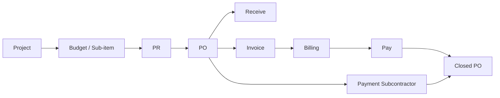
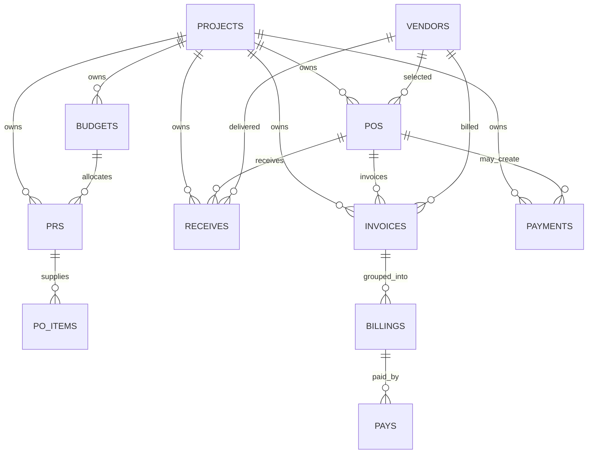

# CMG Budget Control — System & Workflow Audit

วันที่ตรวจสอบ: 11 สิงหาคม 2026  
ขอบเขต: ตรวจจาก source code ใน `src/`, configuration ที่อยู่ใน repository และ flow ที่เชื่อมโยงกันระหว่างโมดูล โดยยังไม่ได้ทดสอบกับข้อมูล production หรือ Firebase Rules จริง

## 1. สรุปผู้บริหาร

ระบบเป็น Single Page Application ที่ใช้ React + Firebase Authentication, Firestore และ Storage โดยข้อมูลธุรกิจหลักถูกเก็บใน Firestore path รูปแบบเดียวกันคือ:

```text
artifacts/{appId}/public/data/{collection}
```

ลำดับกระบวนการหลักคือ:



ข้อสรุปหลัก:

- Flow Budget → PR → PO มีการผูกข้อมูลด้วย `projectId`, `budgetId`, `costCode`, `subItemId`, `prId` และ `selectedPrIds`/`items` ของ PO
- Budget อนุมัติโดย MD แบบรายรายการ; PR ใช้ลำดับ CM → PM และเฉพาะ Contract PR ประเภท DL จึงไป MD; PO ใช้ PCM → GM
- หลัง GM อนุมัติ PO ระบบแยก branch ตาม `receiveType` และการตั้งค่า Pay before Receive / Auto Invoice / Auto Receive
- Receive และ Invoice ไม่ใช่ approval chain เต็มรูปแบบเดียวกับ PR/PO; Invoice มี UI แสดงปุ่ม PM Approve แต่ handler ยังเป็น `undefined` จึงไม่เกิดการ approve จริง
- Payment Subcontractor เป็น flow แยกจาก Payment document ของ PO ทั่วไป และมี approval ระดับสัญญา + approval รายงวดงาน
- ระบบใช้ client-side permission checks จำนวนมาก และ repository นี้ไม่พบ `firestore.rules` หรือ `storage.rules`; จึงยังยืนยันไม่ได้ว่าการป้องกันข้อมูลจากการเขียนตรงทำได้จริงใน production
- มี logic approval ซ้ำระหว่าง `AppDataContext`, `PRView`, `POView` และ `BudgetView` ทำให้กติกาในบางกรณีไม่เหมือนกันและควร refactor ให้มี state machine กลาง

## 2. สถาปัตยกรรมและจุดกลางของระบบ

### 2.1 Application shell

- `src/App.tsx` เป็น root: `AuthProvider` → `AppDataProvider` → `UIProvider` → `AppShell`
- `src/AppShell.tsx` เป็นตัวจัดเมนู, selected project, tab ของ System/Log และ mount View ของแต่ละโมดูล
- `src/auth/AuthContext.tsx` ดูแล login, user profile, user approval status และ system log
- `src/contexts/AppDataContext.tsx` เป็น data bus หลักของระบบ: realtime listeners, CRUD, permissions, pending counts และ handler ของ PR/PO approval
- `src/contexts/UIContext.tsx` ดูแลเมนู, project selection, modal และ state การแสดงผล

### 2.2 การ sync ข้อมูล

`AppDataContext` ใช้ `onSnapshot` กับข้อมูลหลัก:

- realtime: `projects`, `budgets`, `prs`, `pos`, `payments`
- conditional realtime: `invoices`, `receives`, `pays` ตามสิทธิ์การเข้าถึงเมนู
- lazy/one-shot: `vendors`, `materials`, `vendorEvaluations` เมื่อเข้าเมนูที่เกี่ยวข้อง
- settings realtime: `rolePermissions`, `functionPermissions`, `userRoles`, `columnWidths`, `userSettings/{uid}`

`BillingPayView` มี listener ของตัวเองสำหรับ `billings`, `pays` และบางกรณี `invoices`; จึงไม่ได้พึ่งเฉพาะ state จาก `AppDataContext`.

### 2.3 CRUD และ audit log

`addData`, `updateData`, `deleteData` เป็น helper หลักที่เขียน Firestore และสร้าง log โดยมี `skipLog` สำหรับ flow ที่จะ log เองหรือทำหลายขั้นตอนต่อเนื่อง

ข้อสังเกต:

- บาง View เขียน Firestore โดยตรงด้วย `updateDoc`, `setDoc`, `deleteDoc` เช่น Budget, project revision และ admin user management
- การเขียนตรงทำให้รูปแบบ `updatedAt`, duplicate-submit guard และ log behavior ไม่เป็นมาตรฐานเดียวกับ CRUD helper
- ระบบมี guard กัน double update บางส่วนใน `AppDataContext` แต่ไม่ครอบคลุม transaction/การเขียนตรงทั้งหมด

## 3. รายการโมดูลและความสัมพันธ์ข้อมูล

| โมดูล | Collection หลัก | หน้าที่ | ความสัมพันธ์หลัก |
|---|---|---|---|
| Authentication / User | `users` | login, user approval, role, assigned projects, signature | `uid` เชื่อม creator/approver และ log |
| Projects | `projects` | ข้อมูลโครงการ, contract, project budget total, budget revision | parent ของ `budgets`, `prs`, `pos`, `payments`, `invoices`, `receives` |
| Budget | `budgets` | main budget ราย cost code และ `subItems` | `projectId`; ถูกใช้โดย PR ผ่าน `budgetId`/`costCode` |
| Budget Revision | `budgetRevisions` | snapshot ของ budget summary และ attachments ต่อ revision | `projectId`, `revNo` |
| PR | `prs` | ใบขอซื้อ/ขอจ้าง, item, cost code, budget allocation | `projectId`, `budgetId`, `subItemId`; PO item อ้าง `prId` |
| PO | `pos` | ใบสั่งซื้อ/สั่งจ้าง, vendor, items, PR allocation | `projectId`, `selectedPrIds`, item `prId`, `disPrAllocations` |
| Receive | `receives` | รับสินค้า/วัสดุ, จำนวนรับ, ภาพถ่าย, PDF | `poId`, `poNo`, `prNo`; อาจส่งต่อ CMG Store |
| Invoice | `invoices` | ใบแจ้งหนี้, deposit, payment type, invoice status | `poId`, `poNo`, `receiveIds` |
| Billing | `billings` | รวม Invoice เพื่อวางบิล | `invoiceIds`, `poRef`; เปลี่ยน Invoice เป็น `Inpay` |
| Pay | `pays` | จ่าย Billing/Invoice | `billingIds`, `invoiceIds`; เปลี่ยนเป็น `paid` |
| Payment Subcontractor | `payments` | สัญญาผู้รับเหมา/ค่าแรงและงวดงาน | มักสร้างจาก PO ประเภท `SP`/`DC` ผ่าน `selectedPrIds` ที่เก็บ PO ids |
| Vendor | `vendors` | master vendor, credit term, contact | `vendorId` ใน PO, Invoice, Receive, Payment |
| Material | `materials` | master material/autocomplete | `materialNo` ใน PR/PO/Receive |
| Vendor Evaluation | `vendorEvaluations` | ประเมิน vendor ระยะ PO, Receive, Payment | `vendorId`, `evaluationNo`, `poNo`/`paymentId` |
| System Log | `logs` | audit trail | `projectId`, `uid`, role, action, details |

### 3.1 ความสัมพันธ์รายการแบบละเอียด



หมายเหตุ: ความสัมพันธ์ส่วนใหญ่เป็น logical reference ใน document field ไม่ใช่ Firestore subcollection หรือ foreign key ที่ database บังคับให้ถูกต้อง ดังนั้นการลบ/แก้ไขต้องพึ่ง validation ใน UI และโค้ดแต่ละ View.

## 4. Project และ Budget flow

### 4.1 Project lifecycle

สถานะ Project ที่ประกาศใน `ProjectsView`:

```text
Active | Prepare Budget | Complete | Cancel | Close
```

การทำงานสำคัญ:

1. สร้าง Project ด้วย `id = jobNo`
2. กรอก `budgetValue`, `contractValue`, project type, PM/CM, contract และ attachments
3. เมื่อ Project เป็น `Prepare Budget` สามารถตั้ง Budget ได้
4. เมื่อ Project เป็น `Active` ระบบปิดการตั้ง Budget รายการใหม่ในหน้า Budget
5. PM/MD/Administrator ขอ Rev Budget ได้ โดยเขียน `project.budgetRevisionRequest.status = Pending MD`
6. MD/Administrator approve คำขอ → Project กลับ `Prepare Budget`
7. MD/Administrator กด approve & revision → บันทึก snapshot ลง `budgetRevisions`, เพิ่ม `currentBudgetRevision`, update `budgetTotal` และ Project กลับ `Active`

### 4.2 Main Budget

สถานะหลัก:

```text
Draft → Wait MD Approve → Approved
                  └──────→ Rejected
Approved → Revision Pending → Draft → Wait MD Approve
                           └──────→ Approved (ปฏิเสธคำขอแก้ไข)
```

กติกาที่พบ:

- สร้างรายการใหม่เป็น `Draft`
- Submit เปลี่ยนเป็น `Wait MD Approve`
- MD/Administrator approve เปลี่ยนเป็น `Approved`
- MD/Administrator reject เปลี่ยนเป็น `Rejected` พร้อม `rejectReason`
- ผู้มีสิทธิ์ request revision ของ Approved budget จะเปลี่ยนเป็น `Revision Pending`
- MD/Administrator อนุญาตแก้ไข → `Draft`; ไม่อนุมัติ → `Approved`
- มีการตรวจว่า amount ใหม่ไม่ต่ำกว่ายอดที่ถูกใช้โดย PR เพื่อป้องกัน balance ติดลบ
- มีการตรวจ grand total เทียบกับ latest project budget revision

### 4.3 Budget Sub-item

Sub-item ถูกเก็บเป็น array ใน document ของ main budget ไม่ใช่ collection แยก:

```text
Draft → Wait MD Approve → Approved
                  └──────→ Rejected
Approved → Revision Pending → Draft → Wait MD Approve
                           └──────→ Approved
```

กติกา:

- เพิ่ม/แก้ไขได้เมื่อ main budget เหมาะสมตามกติกาของหน้า
- main budget ต้อง `Approved` ก่อน submit sub-item
- ยอดรวม sub-item ห้ามเกิน main budget
- ห้ามลดหรือลบยอด sub-item ต่ำกว่ายอดที่ถูกใช้ใน PR
- มี transaction guard ใน `updateSubItemsWithMainBudgetGuard` สำหรับการ update array และป้องกันข้อมูลล่าสุดชนกัน

## 5. PR flow

### 5.1 การสร้าง PR

PR ที่บันทึกจริงมีข้อมูลสำคัญ:

- `projectId`
- `budgetId`, `selectedBudgetId`, `costCode`
- `subItemId`/`selectedSubItemId`
- `items[]` พร้อม quantity, price, amount, material, budget references
- `purchaseType`, requestor, delivery location, attachments, PDF
- `totalAmount`

การสร้าง/แก้ไข PR ใน `PRView` ตั้งสถานะเป็น `Pending CM` โดยตรง และสร้าง/อัปโหลด PDF ไป Storage.

### 5.2 PR approval chain

```text
Pending CM --CM--> Pending PM
Pending PM --PM--> Approved
Pending PM --PM--> Pending MD   (เฉพาะ Contract PR: DL)
Pending MD --MD--> Approved
ทุกขั้นสามารถ Reject → Rejected
```

การแสดงผลใน PR system view อนุญาตให้ PM กด approve `Pending CM` ได้ แต่ handler กลางใน `AppDataContext` อนุญาตเฉพาะ CM/Administrator ในสถานะนี้ จึงเป็นกติกาที่ไม่สอดคล้องกันระหว่างจุดเรียก.

เมื่อ approve ระบบพยายาม regenerate PDF และ stamp signature ของผู้อนุมัติลง PDF ก่อน update Firestore.

### 5.3 PR revision และ lifecycle หลัง approve

- `Rejected` → Staff/Procurement แก้ไขและ submit ใหม่เป็น `Pending CM`
- `Approved` → Procurement/PCM ขอ `Edit Budget` พร้อมเหตุผล
- `Edit Budget` → ผู้สร้าง PR แก้ไขแล้วบันทึกใหม่เป็น `Pending CM`
- PR ที่ถูกปิด: `Pending Close` → `Closed PR` โดย PCM
- ขอเปิดกลับ: `Closed PR`/`Closed PR Auto` → `Pending Active PR` → PCM approve → resume status เดิมหรือสถานะที่คำนวณจากยอดใช้งาน

### 5.4 PR balance return

PR ที่ approved แล้วสามารถขอคืนยอดที่ยังไม่ถูกใช้กลับ Budget:

1. ผู้มีสิทธิ์เลือกยอดคืนและเหตุผล
2. เขียน `pr.pendingBudgetReturn` และ notification ลง Budget
3. ผู้ดูแล Budget รับยอดคืน
4. transaction อ่าน PR และ Budget ล่าสุดพร้อมกัน
5. scale PR items, ลด `totalAmount`/`amount`, update `budgetReturnRevisions`, ลด `budget.usedAmount`
6. ถ้ายอดใหม่เป็นศูนย์ → `Closed PR Auto`

จุดนี้เป็นส่วนที่ใช้ transaction ได้เหมาะสมกว่าการ update แยกหลายครั้ง.

## 6. PO flow

### 6.1 การสร้าง PO จาก PR

PO เลือกเฉพาะ PR ที่อยู่ในสถานะ `Approved`/`PO Issued` และบางกรณี Contract PR ที่ยัง `Pending PM`; ระบบ:

- lock การเลือก PR หลายใบให้อยู่ `costCode` เดียวกัน
- ดึง item จาก PR เป็น PO item
- คำนวณ used quantity/remaining quantity จาก PO อื่น
- เก็บ `prId`, `prNo`, `budgetId`, `subItemId` ใน PO item
- รองรับ `disPrAllocations` สำหรับการตัดยอดจากหลาย PR ตามรายการ
- เก็บ `selectedPrIds` เป็น reference หลักระดับเอกสาร
- ตรวจไม่ให้ยอด/จำนวนเปิด PO ซ้ำเกิน PR

เมื่อบันทึก draft จะได้ `Draft`; เมื่อ submit/บันทึก PO จริงจะได้ `Pending PCM` และสร้าง PDF.

หลัง PO save ระบบเปลี่ยนสถานะ PR ที่ถูกใช้:

- PR ที่ถูกเปิดครบ/เป็น contract ตามกติกาอาจเป็น `Closed PR Auto`
- PR ที่ยังมี balance จะเป็น `PO Issued`

### 6.2 PO approval chain

```text
Draft → Pending PCM --PCM--> Pending GM --GM--> final branch status
                                      └──────→ Rejected (ถ้า reject)
```

`final branch status` มาจาก `getPoFinalApprovalStatus`:

| เงื่อนไขหลัง GM approve | สถานะ PO | ผลข้างเคียง |
|---|---|---|
| ตั้ง Receive after Payment ครบ | `Paid` | สร้าง Invoice + Receive อัตโนมัติ |
| ตั้ง Pay before Receive Invoice | `Approved` | สร้าง Invoice อัตโนมัติ; สถานะ Invoice ขึ้นกับ payment type |
| `receiveType = Receive Auto` | `Received` | สร้าง Receive อัตโนมัติเต็มจำนวน |
| `receiveType` มี Pay before แต่ไม่ได้ตั้ง auto config | `Wait Invoice` | รอ Invoice/การจ่าย |
| ปกติ | `Approved` | รอ Receive และ Invoice ตามลำดับ |

เมื่อ approve แต่ละขั้น ระบบเก็บ identity/date ของ PCM และ GM และพยายาม regenerate/stamp PDF.

### 6.3 PO edit revision

PO ที่ผ่าน approval/received/closed แล้วไม่ควรแก้ตรง ๆ; ผู้ใช้ขอ revision ตาม `getPORevisionFlow`:

```text
Approved / Received / Closed PO → PO Edit Pending GM → GM allow → Draft
Pending PCM → PO Edit Pending PCM → PCM allow → Draft
Pending GM → PO Edit Pending GM → GM allow → Draft
```

หาก deny จะคืนสถานะเดิมจาก `poEditRevisionResumeStatus`.

เมื่อ allow revision ระบบลบ PDF เดิม, เก็บ `originalPoAmount` pre-VAT และปลดกลับ `Draft` เพื่อแก้ไข.

## 7. PO downstream branches

### 7.1 ปกติ: Receive → Invoice → Billing → Pay

```text
PO Approved
  → Receive (เต็มหรือบางส่วน)
  → PO Received เมื่อรับครบ
  → Invoice
  → Invoice: Invcredit / paid / Deposit
  → Billing: Invoice เป็น Inpay
  → Pay: Billing/Invoice เป็น paid
  → PO เป็น paid หรือ Closed PO ตาม branch
```

Receive รองรับ partial receive โดยเขียน `po.statusNow = Partial Receive`; เมื่อรับครบจึงเปลี่ยน status เป็น `Received`.

### 7.2 Receive Auto

เมื่อ GM approve PO ที่ `receiveType = Receive Auto`:

- สร้าง `receives` จาก PO item ครบ 100%
- ตั้ง `autoCreatedFromPoApproval = true`
- เปลี่ยน PO เป็น `Received`
- ผู้ใช้ไม่ต้องบันทึก Receive เอง

### 7.3 Pay Before Receive

เมื่อเลือก Pay before Receive:

- PO จะรอ Invoice (`Wait Invoice`) ถ้าไม่มีการตั้งค่า auto ครบ
- Invoice มี `invoiceMode = pay_before_receive`
- payment type เครดิตใช้ `Invcredit` → `Inpay` → `paid`
- เงินสด/โอน/เช็คสามารถเป็น `paid` ได้ทันทีตามการสร้าง Invoice
- หลังจ่ายครบ ระบบสร้าง Receive หลัง payment ถ้ามี `receivedAfterPaymentSetup`
- เมื่อ Receive ครบ PO เปลี่ยนเป็น `Paid`

### 7.4 Auto Invoice + Auto Receive

หากตั้งค่าทั้ง Pay before Receive และ Receive after Payment ครบตั้งแต่ PO:

- GM approve สร้าง Invoice และ Receive ในขั้นตอนเดียว
- สถานะ final จาก helper คือ `Paid`
- มี idempotency check ในระดับ UI โดยค้นหา Invoice/Receive เดิมจาก `poId`

## 8. Receive, Invoice, Billing และ Pay

### 8.1 Receive

Receive ไม่มี approval chain แยกแบบ PR/PO; ผู้มีสิทธิ์บันทึกจำนวนรับจริง, วันที่, หมายเหตุ และรูปถ่าย.

ข้อมูล Receive สำคัญ:

- `poId`, `poNo`, `prNo`, `projectId`
- `items[].poItemIndex`, `orderedQty`, `receivedQty`, `price`, `amount`
- `receivedByUid`, `receivedByName`
- PDF และรูปถ่าย
- `cmgStoreSync` สำหรับผลการส่งเข้า CMG Store Management

ถ้า `inventoryType = Inventory` ระบบส่ง payload ไป Firebase project ของ CMG Store Management ที่ path `receivingRequests`; ถ้าส่งไม่สำเร็จ Receive ยังถูกบันทึกไว้แต่ขึ้น `cmgStoreSync.status = failed` และให้ retry ได้.

### 8.2 Invoice

Invoice สร้างได้จาก:

- PO ที่พร้อมรับ Invoice
- Receive ที่เลือกมารวมเป็น Invoice
- auto flow จาก PO approval

สถานะที่ใช้จริง:

```text
Draft | Deposit | Invcredit | Inpay | paid
```

ระบบรองรับหลาย Invoice ต่อ PO, deposit และ settlement ยอดคงเหลือ.

ข้อผิดปกติที่พบ: `MODULE_FUNCTIONS.invoice` มี `approve` และหน้า Invoice แสดงปุ่ม `PM อนุมัติจ่าย` สำหรับ `Pending PM` แต่ `onClick={() => undefined}` ไม่มี implementation เปลี่ยนสถานะ ดังนั้น Invoice approval ตาม UI ยังเป็น dead path และไม่มีสถานะ `Pending PM` ที่ถูกสร้างจาก flow ปัจจุบันอย่างชัดเจน.

### 8.3 Billing

Billing รับ Invoice หลายใบผ่าน `invoiceIds`:

- สร้าง/แก้ไข Billing → Invoice ที่เลือกเป็น `Inpay`, เก็บ `billingNo`/`billingDate`
- Invoice ที่ถูกถอดออกจะย้อนกลับเป็น `Invcredit` หรือ `paid` ถ้ามี Pay เดิม
- PO status ถูกคำนวณใหม่จากสถานะ Invoice ที่เหลือ

### 8.4 Pay

Pay รับ Billing/Invoice:

- Billing ที่เลือก → `paid`, ใส่ `payNo`, `payDate`
- Invoice ที่เลือก → `paid`, ใส่ `payNo`, `payDate`, payment type
- ถ้าเป็น Pay before Receive และ Invoice ทั้งหมดของ PO เป็น `paid`, ระบบสร้าง Receive อัตโนมัติหลัง Pay
- การลบ/แก้ไข Pay มี batch rollback Billing, Invoice, auto Receive และ PO status

## 9. Payment Subcontractor flow

เป็น flow แยกจาก Invoice/Billing/Pay และใช้ collection `payments`.

### 9.1 สร้างสัญญา

- PO ประเภท `SP` หรือ `DC` ที่ `Approved` และยังไม่มี Payment จะขึ้นให้ Activate
- PM/PCM/Administrator สร้าง Payment document จาก PO item
- Payment เริ่ม `Active`; PO จะได้ `statusNow = PMT In Process`
- ผู้ใช้กรอกข้อมูลสัญญาและ Submit เพื่อเข้า approval

### 9.2 Approval ของสัญญา

```text
Draft/Active → Pending CM → Pending PM → Pending MD → Pending Procurement → Active
```

กรณีผู้ submit มี role สูง ระบบอาจข้ามขั้นแรกไป `Pending Procurement`.

ผู้อนุมัติ:

- `Pending CM`: CM
- `Pending PM`: PM หรือ PCM
- `Pending MD`: MD หรือ GM
- `Pending Procurement`: Procurement

ทุกขั้นมี reject เป็น `Reject`, มีเหตุผล และมี revision request ที่ส่งกลับผู้เกี่ยวข้องเพื่อกลับ `Draft` หลังอนุมัติคำขอแก้ไข.

### 9.3 Approval รายงวดและการจ่าย

```text
Active
  → งวดงาน Pending CM
  → งวดงาน Pending PM
  → Wait Pay
  → In Process (ถ้ายังไม่ครบ 100%) หรือ Paid (ครบ 100%)
```

- งวดงานต้องเลือก billing cycle ก่อน submit
- CM check → PM approve
- Procurement upload Pay-in/slip ก่อนกดจ่าย
- progress คำนวณจาก accumulated amount เทียบ contract amount
- Paid ครบ 100% จะปิด PO ที่ถูกเลือกเป็น `Closed PO`
- Complete Job บันทึก vendor evaluation และตั้ง Payment เป็น `Paid`
- Start Next Period จะสร้าง Payment ใหม่ period ต่อไปและสะสมยอดเดิม

## 10. Authorization และ approval ownership

### 10.1 Module access

`MODULE_ACCESS` กำหนดสิทธิ์ระดับเมนู และ `functionPermissions` กำหนดสิทธิ์ระดับ action โดย Administrator bypass ทุก action.

บทบาทหลักตามโค้ด:

| Role | หน้าที่เด่น |
|---|---|
| Staff | สร้าง/กรอก PR, Receive และข้อมูลปฏิบัติการบางส่วน |
| Procurement | สร้าง/แก้ไข PR, สร้าง PO, Invoice, Billing/Pay และ Payment contract |
| CM | approve PR ขั้น CM และ Payment/งวดงานขั้น CM |
| PM | approve PR ขั้น PM, Payment/งวดงานขั้น PM, Activate Payment |
| PCM | approve PO ขั้น PCM, allow PO revision, active PR, Payment ขั้น PM |
| GM | approve PO ขั้น GM และ Payment ขั้น MD ในบาง flow |
| MD | approve Budget, Contract PR, Project Budget Revision และ Payment ขั้น MD |
| Administrator | bypass ทั้งหมดตาม client-side checks |

### 10.2 Project visibility

ผู้ใช้ที่ไม่ใช่ Administrator เห็นเฉพาะ Project ที่อยู่ใน `userData.assignedProjectIds`; แต่ข้อมูล collection หลักมี listener แบบ global แล้วกรองการแสดงผลภายหลัง จึงควรตรวจ Firestore Rules เพิ่มว่าผู้ใช้ไม่สามารถอ่าน project อื่นได้จาก client โดยตรง.

## 11. จุดที่พบว่าไม่สอดคล้องหรือมีความเสี่ยง

### ระดับสูง

1. **ไม่พบ Firestore/Storage security rules ใน repository**
   - การอนุมัติและ CRUD จำนวนมากถูกตรวจด้วย React function เช่น `canUseFunction`
   - หาก Rules ฝั่ง Firebase อนุญาตกว้าง ผู้ใช้ที่มี session อาจเขียนสถานะอนุมัติโดยตรงได้
   - ควรมี Rules หรือ backend callable/server function บังคับ role, project scope และ status transition ซ้ำ

2. **Approval logic ซ้ำและไม่ตรงกัน**
   - PR approval มีทั้ง `AppDataContext.handlePRAction` และ `PRView.handleAction`
   - ตัวอย่างชัดเจน: Pending CM ใน PRView อนุญาต PM แต่ Context อนุญาต CM เท่านั้น
   - PO ก็มีทั้ง Context handler และ local handler ใน POView
   - ควรทำ transition service กลางเพียงชุดเดียว

3. **Invoice approve action ยังไม่ทำงาน**
   - ปุ่ม PM approve มี `onClick={() => undefined}`
   - สิทธิ์ `invoice.approve` มีใน constants แต่ไม่ครบ end-to-end
   - ต้องตัดฟังก์ชันนี้ออกถ้ายังไม่ใช้ หรือ implement status transition และ audit log ให้ครบ

### ระดับกลาง

4. **สถานะ PO มีทั้ง `status` และ `statusNow`**
   - หลายโมดูลอ่านคนละ field และมีการ update บางครั้งพร้อมกัน บางครั้งไม่พร้อมกัน
   - เสี่ยงต่อหน้าจอ/รายงานเห็นสถานะไม่ตรงกัน
   - ควรกำหนด `status` เป็น canonical field และให้ `statusNow` เป็น derived/legacy หรือเลิกใช้

5. **ความสัมพันธ์เป็น soft reference**
   - ไม่มี foreign key; การลบ Budget/PR/PO ต้องพึ่ง UI guard
   - มีโอกาสเกิด orphan references หากเขียนตรงหรือมีการแก้ข้อมูลจากหลาย tab
   - ควรมี referential validation และ soft delete/closed state แทนการลบเอกสารที่ถูกใช้แล้ว

6. **การสร้างผลข้างเคียงหลัง approve ไม่ได้เป็น transaction เดียว**
   - PO GM approve อาจสร้าง Invoice, Receive, แล้วค่อย update PO
   - หากขั้นกลางล้มเหลว อาจเกิด Invoice/Receive แล้ว PO ยัง Pending GM หรือกลับกัน
   - มี idempotency check บางส่วน แต่ยังไม่ใช่ atomic workflow

7. **Pending counts กับสถานะจริงกระจายหลายชุด**
   - Badge ใช้ logic ใน `AppDataContext`
   - หน้า Budget/PR/PO มี filter และ permission เพิ่มเอง
   - เมื่อเพิ่ม status ใหม่ต้องแก้หลายที่ เสี่ยง badge ไม่ตรงกับปุ่มที่กดได้

### ระดับควรปรับปรุง

8. **Client listener อ่าน collection แบบ global แล้วกรองภายหลัง**
   - ดีต่อ UX/realtime แต่ไม่เหมาะกับข้อมูลที่ต้องแยกตาม project หาก Rules ไม่จำกัด
   - ควร query ตาม project scope หรือใช้ server-side access control

9. **การเขียนตรง Firestore ทำให้ audit behavior ต่างกัน**
   - Budget และบาง admin/project revision path ไม่ได้ผ่าน CRUD helper
   - ควรห่อทุก state mutation ด้วย domain service ที่กำหนด `updatedAt`, actor, transition และ log

10. **ข้อมูล role มีทั้ง `role` และ `roles[]`**
    - ระบบ merge สอง field ซึ่งช่วย backward compatibility แต่เพิ่มความซับซ้อนและอาจทำให้ approval scope แตกต่างระหว่างหน้า
    - ควรกำหนด `roles[]` เป็น canonical และ migrate `role` ให้เป็น display/default เท่านั้น

## 12. Test scenarios ที่ควรมีเป็น acceptance test

1. Budget Draft → Submit → MD Approve → PR สร้างได้
2. Budget Revision Pending → MD allow/reject และตรวจว่า PR ที่ใช้ยอดอยู่ไม่ทำให้ balance ติดลบ
3. Sub-item submit ก่อน main Budget Approved ต้องถูก block
4. PR ปกติ: CM → PM → Approved
5. Contract PR DL: CM → PM → MD → Approved
6. PR reject → edit → resubmit และ `usedAmount` ต้องคำนวณใหม่
7. สร้าง PO จากหลาย PR cost code ต่างกันต้องถูก block
8. เปิด PO ซ้ำจนเกิน quantity/amount PR ต้องถูก block
9. PO: PCM → GM → Approved
10. PO Receive Auto: GM approve แล้วต้องมี Receive เดียวและครบจำนวน
11. PO Pay Before Receive: Invoice → Billing/Pay → Receive หลังจ่าย
12. ลบ Pay ต้อง rollback Invoice/Billing/auto Receive/PO status ให้ครบ
13. Partial Receive ต้องเป็น `Partial Receive` และรับเพิ่มจนเป็น `Received`
14. Payment Subcontractor: contract approval และ period approval แยกกันถูกต้อง
15. Payment ครบ 100% ต้องปิด PO ที่เชื่อมอยู่
16. ผู้ใช้ต่าง project ต้องอ่าน/เขียน project อื่นไม่ได้ทั้ง UI และ direct Firestore
17. ยิง approve ซ้ำจากสอง tab ต้องไม่ข้ามสถานะหรือสร้าง Invoice/Receive ซ้ำ
18. PDF/Storage upload ล้มเหลวกลาง approval ต้องไม่ทิ้งข้อมูลค้างผิดสถานะ

## 13. ข้อเสนอแนะลำดับการแก้ไข

### P0 — ควบคุมความถูกต้องและความปลอดภัย

- ตรวจและเพิ่ม Firestore/Storage Rules ตาม role และ assigned project
- ย้าย transition สำคัญ Budget/PR/PO/Payment ไป backend transaction หรือ callable function
- กำหนด canonical status field และ migration ของ `statusNow`

### P1 — ลดความเสี่ยงจาก logic ซ้ำ

- สร้าง `workflowTransitions.ts` หรือ domain service เดียวสำหรับ `canApprove`, `nextStatus`, `reject`, `revision`
- ให้ View เรียก service กลาง ไม่ implement transition เอง
- ทำ idempotency key สำหรับ auto Invoice/Receive และตรวจซ้ำจาก server

### P2 — ปิดงานที่ยังไม่ครบ

- Implement หรือเอา Invoice approve UI/permission ออก
- เพิ่ม automated tests สำหรับ transition matrix
- เพิ่ม data integrity report: orphan PR, PO ที่ไม่มี PR, Invoice ที่ไม่มี PO, Receive ที่ไม่มี PO, duplicate document no
- แยก collection/เอกสาร approval history จาก current record หากต้องการ audit ที่ตรวจสอบย้อนหลังได้เข้มงวด

## 14. ไฟล์อ้างอิงหลักที่ตรวจ

- `src/App.tsx`, `src/AppShell.tsx`
- `src/auth/AuthContext.tsx`, `src/auth/AuthForm.tsx`
- `src/contexts/AppDataContext.tsx`, `src/contexts/UIContext.tsx`
- `src/lib/constants.ts`
- `src/lib/poDocumentFlow.ts`, `src/lib/receiveAuto.ts`, `src/lib/prAllocation.ts`, `src/lib/prBudgetReturn.ts`
- `src/views/ProjectsView.tsx`, `BudgetView.tsx`, `PRView.tsx`, `POView.tsx`
- `src/views/ReceiveView.tsx`, `InvoiceView.tsx`, `BillingPayView.tsx`, `PaymentView.tsx`
- `src/views/VendorView.tsx`, `MaterialView.tsx`, `DashboardView.tsx`
- `src/views/BudgetSummaryReportView.tsx`, `ProjectSpendingView.tsx`, `UserManualView.tsx`
- `src/lib/cmgStoreSync.ts`, `src/lib/pdfForms.ts`, `src/lib/*SignatureStamps.ts`

## บทสรุปสุดท้าย

ระบบมีโครงสร้างธุรกิจครบตั้งแต่ Project/Budget ไปจนถึง PR, PO, Receive, Invoice, Billing, Pay และ Payment Subcontractor โดยมีการรองรับ flow พิเศษค่อนข้างมากและมี audit log/PDF/attachments ประกอบ อย่างไรก็ตาม ความถูกต้องในระดับ workflow ยังขึ้นกับโค้ดฝั่ง client และ logic ถูกทำซ้ำหลายจุด จึงควรให้ความสำคัญกับ security rules/backend enforcement, รวม transition กลาง และแก้ Invoice approval ที่ยังไม่ทำงาน ก่อนนำ flow ไปใช้เป็นกระบวนการควบคุมทางการเงินจริง.
